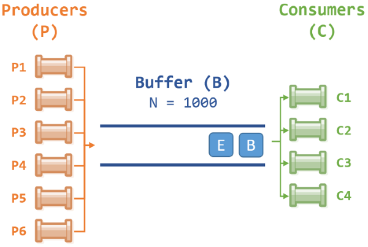

# PA4: Producer/Consumer

**Purpose:** Understanding mutual exclusion, deadlock, and time measurement.

## Requirements 
The problem is simple. Implement a producer/consumer problem instance with the number of producers and consumers given as run-time argument:
```
./myAssignment4 run_time num_producers max_sleep_producer num_consumers max_sleep_consumer
```

```
$ ./myAssignment4 10 6 45 4 72
```

```
run_time = 10 sec
num_producers = 6
max_sleep_producer = 45 ms
num_consumers = 4
max_sleep_consumer = 72 ms
```


> Each producer P# and each consumer C# is a process, and the buffer B will also be in its own process. This is a good demonstration of interprocess communication between multiple processes.

- [ ] MUST use three file structure
- [ ] MUST create a Makefile
- [ ] MUST breakdown your solution into manageable functions

## Your Task
1. A starter source file has been provided, open **producer_consumer.c**.
2. Implement a program, called **myAssignment4**, that will run the given number of *producers* **P**  and *consumers* **C** (each implemented as a process) and an additional process called *buffer* **B** implemented as a queue. **B** maintains a buffer of size `N=1000`, and the *product* is a character. Thus, we have an array of characters of size **N** located in the *buffer*.
3. You communicate via [**unnamed pipes**](https://man7.org/linux/man-pages/man2/pipe.2.html), i.e., each producer will use a pipe to **B** and each consumer will have a pipe from **B**. Thus **P** pipes/*produce* into **B** and **C** pipes/*consumes* from **B**'s character array.
    ```cpp
    /** @brief How to create unnamed pipes */
    #include <unistd.h>
    
    #define READ 0
    #define WRITE 1
    
    int main()
    {
        int fd[2]; ///< read/write file descriptor
        pipe(fd);  ///< creates an unnamed pipe
                   ///< fd[READ] or fd[0] is for reading data from the pipe
                   ///< fd[WRITE] or fd[1] is for writing data to the pipe
    }
    ```
3. Assume that production and consumption times are random values, uniformly distributed, with max times `max_sleep_producer` and `max_sleep_consumer` for production and consumption times respectively. We assume that the time for accesing the buffer in negligible. 
4. Measure the average size of buffer **B**.
5. The input to program **myAssignment4** is the number of seconds the program is supposed to run and values for `max_sleep_producer` and `max_sleep_consumer` in milliseconds. An example, using the exact format
    ```
    ./myAssignment4 run_time num_producers max_sleep_producer num_consumers max_sleep_consumer
    ```
    would be
    ```
    $ ./myAssignment4 30 7 45 4 72
    ```
    In this example, program simulators **runs for 30 seconds** with **7 producers** and **4 consumers**, **max_sleep_porducer=45ms** and **max_sleep_consumer=72ms**. Observe that these are max values, meaning the sleep is a **random time from 0ms to max_sleep_producer** and same for consumer.
6. The output of the producers and consumer processes should look like this:
    ```
    P5 wrote F
    P6 wrote G
    P4 wrote E
    P3 wrote D
    P2 wrote C
    P1 wrote B
    B received string: D from producer 3
    Current Size 1
    B received string: E from producer 4
    Current Size 2
    B received string: F from producer 5
    Current Size 3
    B received string: G from producer 6
    Current Size 4
    Writing Current Size 3
    B wrote string: F to consumer 0
    C0 read F
    Writing Current Size 2
    B wrote string: D to consumer 1
    C1 read D
    Writing Current Size 1
    B wrote string: E to consumer 2
    C2 read E

    ... <<A whole lotta stuff written here>>

    Current Size 1
    Writing Current Size 0
    B wrote string: G to consumer 0
    P5 wrote F
    C3 read E
    P3 wrote D
    P4 wrote E
    C2 read E
    C1 read A
    Time is up
    Producer 0 terminated
    Producer 1 terminated
    Producer 2 terminated
    Producer 3 terminated
    Producer 4 terminated
    Producer 5 terminated
    Producer 6 terminated
    Consumer 0 terminated
    Consumer 1 terminated
    Consumer 2 terminated
    Consumer 3 terminated
    Program complete

    Average Buffer size: 35
    ```
    where each producer or consumer prints out a line indicating its random run-time between `(0, t_max]`, i.e., a run-time greater than `0` and less than or equal to `t_max`.
    
7. Before terminating, your program should print out the average size of the buffer, e.g.
    ```
    Average Buffer size: 35
    ```

> This assignment is quite tricky and involves multiple processes, pipes and measuring time.

## Extension to the Program (Not Required)
Make any sort of animation when the proram is running to show what is happening in each of the processes (focusing mainly on what is happening in process B).

## Submit
Make sure code is committed and pushed to Github. Submit GitHub URL in Canvas.
